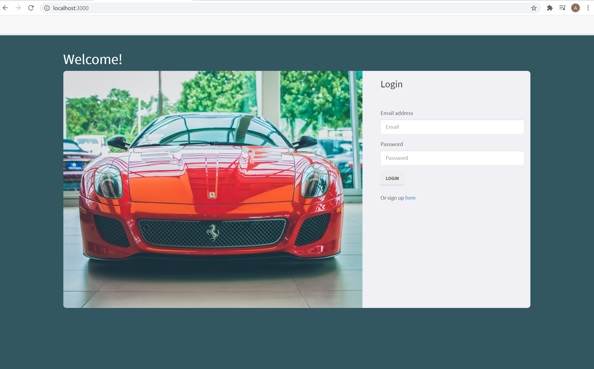

# Asset Tracker

## Description

This is a full stack application that follows the MVC design pattern. The program allows users to sign up to be a member and sign in if they're already a member. The application is designed to keep track of registered companys vehicles in the database and manipulate easly to add new vehicles, view list of vehicles, update existing vehicles information and delete if necessary.

## Table of Contents

* [Installation](#installation)
* [Usage](#usage)
* [contributing](#credits)
* [License](#license)
* [Issues](#issues)
* [Questions](#questions)

## Installation
The program uses MYSQL, Sequelize ORM and Node to query and route data in the app. Express for the backend web framework and handlebars to dynamically generate the HTML. Twilio's Rest API to query and manage data and also to send notifications via text message.

## Usage 
To run this application locally, Install the dependencies, verify database connection information, run the database in my SQL Workbench. Run `node server.js` on your terminal to start the server and follow the link or open it on your browser to view the application your computer(locally). The application running on Heroku can be found [Here](https://arcane-basin-49331.herokuapp.com/)

## Contribution

When contributing to this repository, please first discuss the change you wish to make via issue, email, or any other method with the owners of this repository before making a change.

## License
    MIT

## Issues

Feel free to submit issues and enhancement requests.

## Questions?
For any questions you may have, feel free to find me via the information provided below:

Email:
afetyusuf.gggnc@gmail.com

[Github Page]

* [HananYusuf](https://github.com/HananYusuf/)
* [ChefJayPeek](https://github.com/ChefJayPeek)
* [KenOginga](https://github.com/KenOginga)

